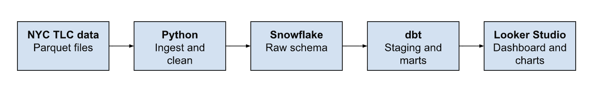
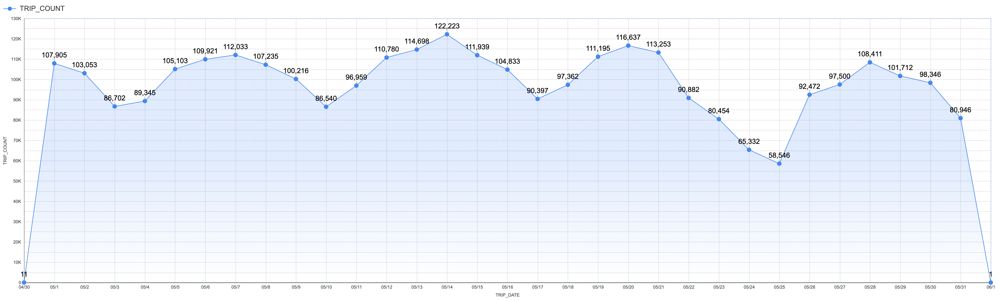
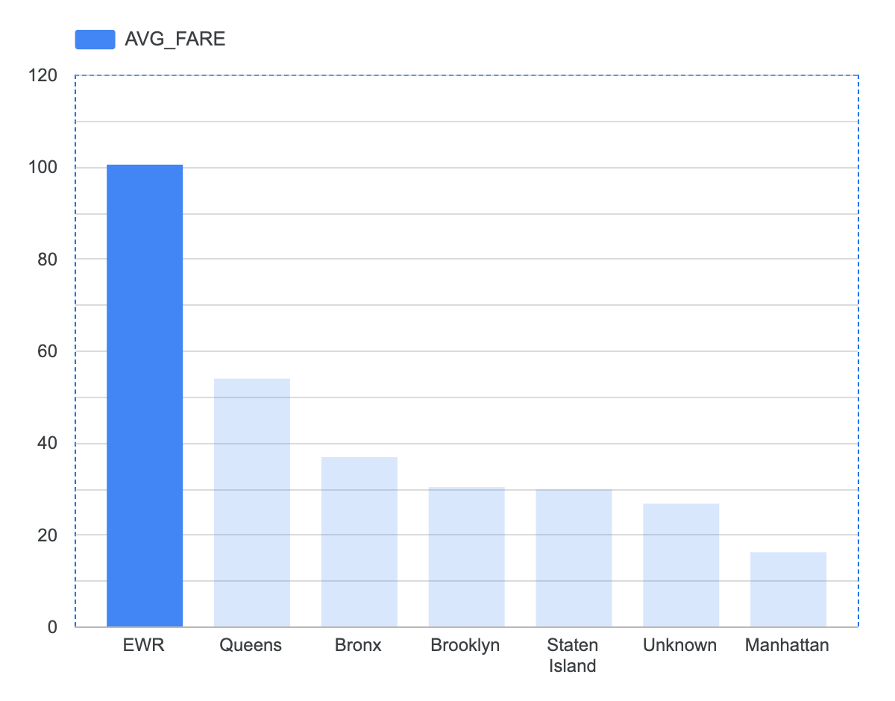
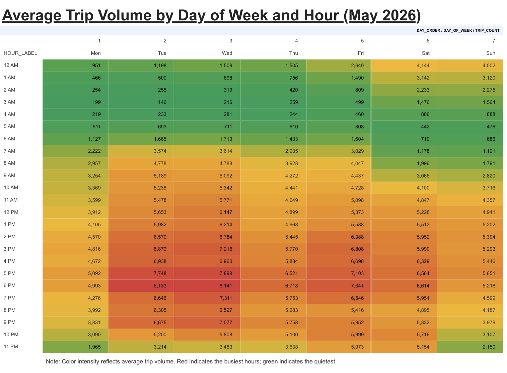

# NYC Taxi Trip Data Pipeline

An end-to-end data engineering pipeline that ingests, transforms, and visualizes NYC Yellow Taxi trip data using Python, Snowflake, and dbt.

## What this project does

- Ingests ~3 million raw taxi trip records (May 2026) from NYC TLC's public dataset into Snowflake
- Cleans and transforms the data using dbt into staging, fact, and aggregate models
- Joins trip data with NYC taxi zone lookup data to analyze fares by borough
- Visualizes key metrics in Looker Studio: daily trip volume, average fare by borough, and peak hours by day/hour

## Architecture

Raw parquet files are ingested with Python and loaded in Snowflake, then transformed through dbt's staging and marts layers, and finally visualized in Looker Studio.

## Tools used

- **Python** — data extraction and loading (pandas, snowflake-connector-python)
- **Snowflake** — cloud data warehouse
- **dbt** — data transformation and testing
- **Looker Studio** — dashboard visualization
- **Git/GitHub** — version control

## Project structure

- `data/` — raw data files (gitignored)
- `screenshots/` — dashboard chart images and architecture diagram
- `ingest.py` — loads taxi trip data into Snowflake
- `load_zones.py` — loads taxi zone lookup into Snowflake
- `taxi_project/` — dbt project
  - `models/staging/`
    - `stg_taxi_trips.sql`
    - `stg_taxi_zones.sql`
  - `models/marts/`
    - `fct_trips.sql`
    - `agg_daily_summary.sql`
    - `agg_fare_by_borough.sql`
    - `agg_peak_hours.sql`

## Data dictionary

Key columns in the final mart models:

| Column | Model | Description |
|---|---|---|
| `trip_duration_minutes` | `fct_trips` | Minutes between pickup and dropoff, calculated from raw timestamps |
| `cost_per_mile` | `fct_trips` | Total fare divided by trip distance, null if distance is zero |
| `trip_count` | `agg_daily_summary`, `agg_peak_hours` | Number of trips in the given grouping (day, or day/hour) |
| `avg_fare` | `agg_fare_by_borough` | Average fare amount for trips picked up in that borough |
| `day_order` | `agg_peak_hours` | Numeric Mon=1–Sun=7 mapping, used to sort day names chronologically |
| `hour_label` | `agg_peak_hours` | Hour of day formatted as 12-hour time (e.g. "6 PM") for display |
| `borough` | `agg_fare_by_borough` | NYC borough of the pickup location, joined from the TLC zone lookup table; "Other" includes unresolved zones |

## Data quality

Data quality is validated with 10 dbt tests across the pipeline, split into two categories: basic completeness checks and deeper logical checks.

### Completeness checks (7 tests)

These confirm that critical fields are never missing and that key records aren't duplicated:

- `pickup_datetime`, `dropoff_datetime`, `trip_distance`, and `total_amount` in `stg_taxi_trips` are never null — a trip record without these fields is unusable for analysis
- `trip_duration_minutes` in `fct_trips` is never null — confirms the pickup/dropoff calculation succeeded for every row
- `trip_date` in `agg_daily_summary` is never null and never duplicated — confirms the daily aggregation has exactly one row per calendar day, with no gaps or double-counted days

### Logical validity checks (3 tests)

These go beyond "is it missing" to check whether the data actually makes sense:

**Accepted values on `payment_type`** — NYC TLC's data dictionary defines only six valid payment type codes (1–6: credit card, cash, no charge, dispute, unknown, voided trip). This test fails if any other value appears, which would indicate either a parsing error in the source data or a schema change upstream that needs investigating.

**Relationship check between `fct_trips` and `stg_taxi_zones`** — every trip has a pickup location ID (`pu_location_id`), and this ID should always correspond to a real taxi zone in the official TLC zone lookup table. This test verifies that referential integrity holds — if a trip pointed to a location ID with no matching zone, it would silently break any borough-level analysis (like the fare-by-borough chart) without this test to catch it.

**Custom range check on `fare_amount`** — a hand-written test (not a built-in dbt test) that flags any trip with a fare over $500 paired with a distance under 5 miles, or any negative fare. Straightforward "fare > $X" checks turned out to be too blunt: legitimate long-distance trips (over 100 miles, several hours) can have fares well above $500 and are not errors. The test instead combines fare *and* distance, so it isolates the real anomaly — a high fare on an implausibly short trip — while leaving genuine long trips alone.

### Known finding: 9 flagged trips

This custom fare test currently fails, flagging 9 trips out of roughly 3 million. Investigating them directly in Snowflake showed a clear pattern: each one has an extremely high fare (up to $5,525.99) paired with a trip lasting well under a minute and covering under half a mile — for example, a $5,525.99 fare on a 14-second, 0.39-mile ride. This is consistent with a metering or data-entry error at the source, not a real trip.

Rather than silently filtering these 9 rows out of the pipeline, the test is left in a failing state on purpose. The reasoning: a passing test suite that never catches anything doesn't actually demonstrate that the checks work, and quietly dropping anomalous rows makes them invisible to anyone auditing the pipeline later. Leaving the test failing — with the finding documented here — mirrors how a real production data quality monitor is meant to work: surface unexpected records for a human to review, rather than making an automatic judgment call about which real-world trips are "wrong."

## How to run this

## How to run this

1. Clone this repo
2. Download the source data:
   - [NYC TLC Trip Record Data](https://www.nyc.gov/site/tlc/about/tlc-trip-record-data.page) — download the May 2026 Yellow Taxi parquet file into `data/`
   - [Taxi Zone Lookup Table](https://www.nyc.gov/site/tlc/about/tlc-trip-record-data.page) (same page, scroll to "Taxi Zone Lookup Table") — download the CSV into `data/`
3. Create a `.env` file with your Snowflake credentials (see `.env.example`)
4. Install dependencies: `pip install pandas pyarrow snowflake-connector-python python-dotenv dbt-snowflake`
5. Run `python3 ingest.py` and `python3 load_zones.py` to load raw data
6. `cd taxi_project` and run `dbt run` to build all models
7. Run `dbt test` to validate data quality (9/10 tests passing — see Data Quality section)

## Dashboard

View the live interactive dashboard [here](https://datastudio.google.com/reporting/383e095f-d720-4357-ad55-37f3dd818c55).

## Visualizations

### Daily Trip Volume
Total taxi trips per calendar day across May 2026, revealing overall demand patterns and weekly rhythm across the month.

### Average Fare by Borough
Average fare for trips picked up in each NYC borough, joined from the TLC taxi zone lookup table. "Other" includes trips with unresolved location data.

### Average trip volume by day of week and hour
A heatmap showing average trips per hour, broken out by day of the week. Values are averaged across each weekday's occurrences in the month (e.g. all Fridays averaged together), not summed, so the numbers reflect a typical day rather than a monthly total.

## Key insights

- Weekend early mornings (12–2 AM) see significantly higher trip volume than weekday mornings
- EWR (Newark Airport) trips have the highest average fare, as expected for long-distance airport runs
- Weekday evening rush hours (5–9 PM) show consistent peak demand